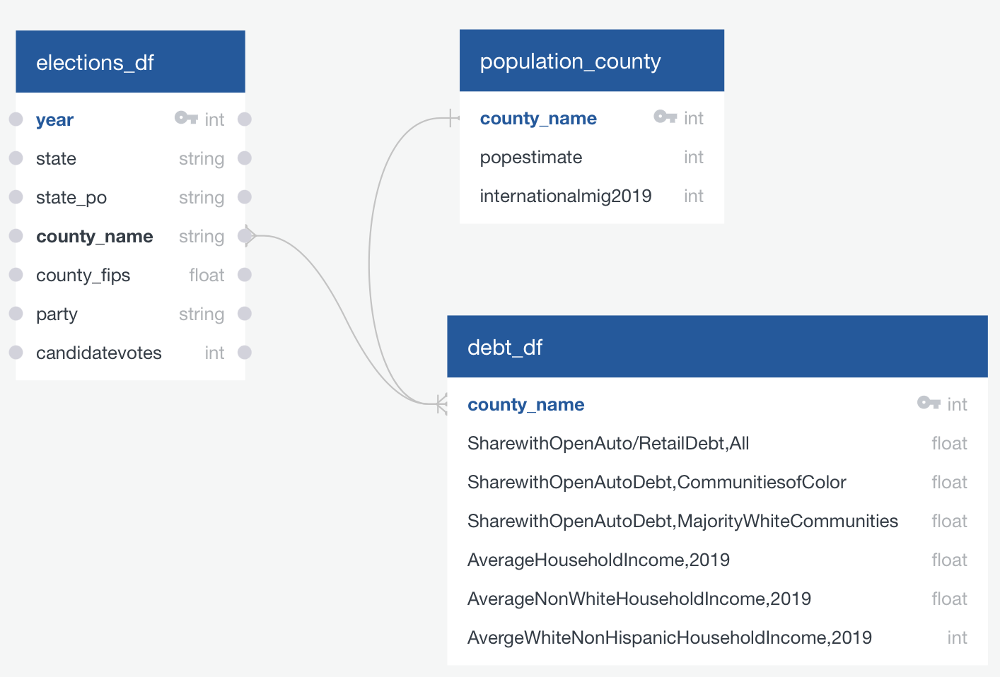

# Final_project: 
Presidential Elections in the US (2000-2020): the ideology behind the citizen vote.

# Abstract: 
What makes a citizen vote for a democrat party?

# Selection of topic: 
People with similar ideas usually belong to the same political party, the two main parties in the US are Republican, and Deomocrat, so which ideas make peope to stay in one party?What cultural, economic, social and political indicators lead to vote for a certain political party.

# Hypothesis: 
The electorate votes according to their convictions (in theory), but certain indicators show that this is not always the case. And we are going to demonstrate which ones do and which ones do not have an influence on the vote. HYPOTHESIS NOT 

# Description of the  data
The political system of the US is based on a series of relatively simple electoral rules, based on the logic of the majority (winners takes it all), with highly decentralized electoral management and very little post-election litigation; which has led the US to have one of the most stable electoral systems in the world. Therefore, several institutions and government agencies keep records of the presidential elections since they started. Like exit polls, panel studies, but also they keep track of social issues such as racial indicators, partisanship, perception of security, economy, to name a few.

In this project, we will use as variables for our analysis, all of them at county level: 
- number of votes per party
- population
- migration
- average income
- debt

 ### 1. Harvard Dataverse
 Harvard's open online repository for sharing, preserving, citing, exploring and analyzing research data.

Harvard Dataverse is an online data repository for share, preserve, cite, explore, and analyze research data. It is open to all researchers, both inside and out of the Harvard community.The Harvard Dataverse repository runs on the open-source web application Dataverse, developed at the Institute for Quantitative Social Science. Dataverse helps make data available to others, and allows to replicate others' work more easily.

#### For this project we are going to use:
- *County Presidential Election Returns 2000-2020*
- Data citation:
MIT Election Data and Science Lab, 2018, "County Presidential Election Returns 2000-2020", https://doi.org/10.7910/DVN/VOQCHQ, Harvard Dataverse, V11, UNF:6:HaZ8GWG8D2abLleXN3uEig== [fileUNF]

- Web site: https://dataverse.harvard.edu/dataset.xhtml?persistentId=doi:10.7910/DVN/VOQCHQ

### 2. Urban Data Catalog, Urban Institute

The Urban Institute Data Catalog is a place to discover and download open data provided by Urban Institute researchers and data scientists. From here, we are using *Debt in America 2022*  the dataset contains information derived from a random sample of deidentified, consumer-level records from a major credit bureau. The credit bureau data are from February 2022 and contain more than five million records.

#### For this project we are going to use:
- *Debt in America: County-Level Auto Debt*: 
- Data citation: 
Alexander Carther, Kassandra Martinchek, Breno Braga, Signe-Mary McKernan, and Caleb
Quakenbush. 2022. Debt in America February 2022. Accessible
from https://datacatalog.urban.org/dataset/debt-america-2022 .

- Web site: https://datacatalog.urban.org/dataset/debt-america-2022

### 3. The Census Bureau, official website of the Unted Srates government

The Census Bureau´s mission is measuring America´s people, places and economy. 

We know the importance of having reliable databases, that is why we adopt the idea that our sources of information come from official and secure sources. Therefore, we extracted the infrmotion we requiered form the Census Bureau datasets.

#### For this project we are going to use:
- *County Population Totals: 2010-2021*
- Web site: https://www.census.gov/data/datasets/time-series/demo/popest/2020s-counties-total.html

# Final Database structure
Sample data that mimics the expected final database structure or schema.

The resources for connecting the model with our data base are stored in an AWS S3. The databases can be be extracted with the following links:

**elections_df:** https://dataanalyticsfinalproject2022.s3.us-east-2.amazonaws.com/Resources/countypres_2000-2020.csv
**population_county:** https://dataanalyticsfinalproject2022.s3.us-east-2.amazonaws.com/Resources/co-est2019-alldata.csv
**debt_df:** https://dataanalyticsfinalproject2022.s3.us-east-2.amazonaws.com/Resources/county_dia_auto_+7+Jun+2022.csv
Draft machine learning module is connected to the provisional database.

# Machine Learning Model
We chose a Random forest model because of its high accuracy and interpretability. It can easily handle non-linear data and outliers. The input will be in the form of tabular data (no images or natural language). In addition, a random forest model with a sufficient number of estimators and tree depth should be able to perform at a similar capacity to most deep learning models but with less resources.

 It will require preprocessing with (one Hot Encoder) for the categorical variables. Depending on the length of unique values, we might need to bucket certain data.

After having everything in numerical values, we will standardize the data. Because our dataframe is more larger than wider, we will keep the default percentage of training and testing data (75% for training and 25% for testing).

The data will have over 22000 rows, 9 features, and 1 target column. The target will be numerical, 1 for the counties where the Democrat party won and 0 for counties where other parties won. The model will be able to predict if the county will win Democrat according the features (population, income, debt, etc.) that were considered.

Draft of a random forest model:

1. Generate dummy dataset
2. Creating a DataFrame with the dummy data
3. Use sklearn to split datasets for train and test
4. Create scaler instance
5. Fit the scaler
6. Scale the data
7. Create a random forest classifier.
8. Fitting the model
9. Evaluate the model
# Communication protocols:
The communication protocols will be based on two elements: 
1. Daily zoom meetings to give instructions on the steps to follow, assign functions, agree on tasks, define the project itself, and answer questions. 
2. Constant communication through whatsapp.
3. Team members: 
    * Circle - Alejandra López 
    * Triangle - Dylan Montemayor 
    * Square - Samuel Alvarez 
    * X - Eduardo Huerta  
